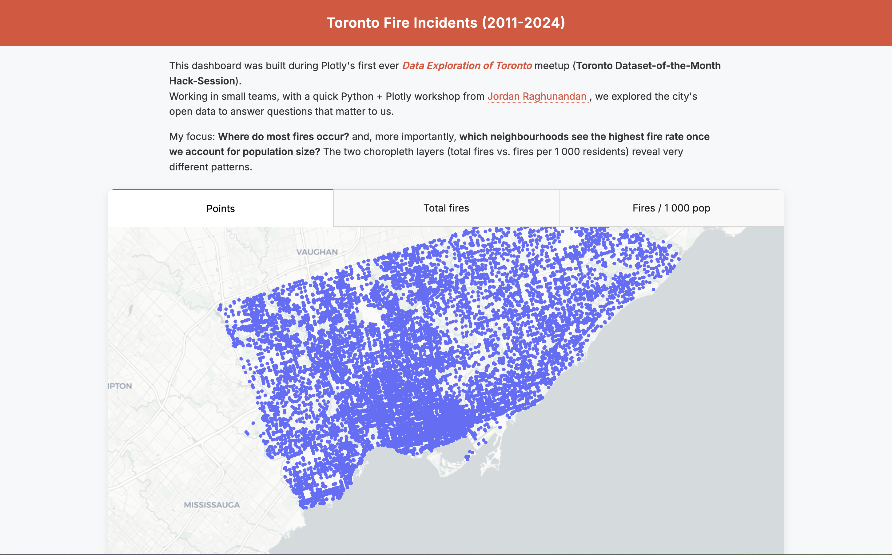

# 🔥 Toronto Fire Incidents – Interactive Dash Dashboard

[Live demo → toronto-fire-incidents-plotly.onrender.com](https://toronto-fire-incidents-plotly.onrender.com)

An interactive Plotly Dash web-app that maps **every Toronto Fire Service incident from 2011-2024** and lets you compare:

1. **Total fires per ward**  
2. **Fires per 1 000 residents** (2021 Census)  
3. **Raw point cloud** of individual incidents  

The project was built during Plotly’s *Data Exploration of Toronto* hack-session as a quick way to see **where fires cluster, and which neighbourhoods face the greatest per-capita risk.**

---

## 📸 Screenshot

<p align="center">
  
</p>

*(Your first run will generate the same view; feel free to replace the placeholder with a real screenshot.)*

---

## ✨ Key features

| Feature | Details |
|---------|---------|
| **Interactive layers** | Tabs switch between points, total-fire choropleth, and rate-per-population choropleth. |
| **Population-normalised view** | Ward populations pulled from the City’s 2023 Ward Profiles Excel; rates computed on the fly. |
| **No Mapbox token needed** | Uses Carto Positron tiles (open-source). |
| **Zero-config hosting** | Runs on [Render](https://render.com) free tier—just a Procfile and `requirements.txt`. |
| **Extensible** | Code ready for filters on `Extent_Of_Fire` and `Final_Incident_Type` (next-steps section). |

---

## 🚀 Quick start (local)

```bash
# 1. clone
git clone https://github.com/Andrew-Girgis/toronto-fire-incidents-plotly.git
cd toronto-fire-incidents-plotly

# 2. create venv (optional but recommended)
python -m venv venv
source venv/bin/activate  # Windows: venv\Scripts\activate

# 3. install deps
pip install -r requirements.txt

# 4. run
python app.py
# open http://127.0.0.1:8050 in your browser
```
## Folder Structure
```
.
├── app.py             # Dash app (single-file, 250 LOC)
├── requirements.txt   # python libs for Pip/Render
├── Procfile           # gunicorn start cmd for Render
└── assets/            # static files auto-served by Dash
    ├── style.css      # minimal Tailwind-ish styling
    ├── script.js      # tiny fade-in JS (optional)
    └── screenshot.png # hero image for README
```
## Data Sources

| Dataset                                  | Link                                                                                                                       |
| ---------------------------------------- | -------------------------------------------------------------------------------------------------------------------------- |
| Toronto Fire Service Incidents 2011-2024 | [Open Data Portal](https://open.toronto.ca/dataset/toronto-fire-service-incidents/](https://open.toronto.ca/dataset/fire-incidents/))|
| City Ward Boundaries (25-ward, 2018)     | [Open Data Portal](https://open.toronto.ca/dataset/city-ward-boundary/](https://open.toronto.ca/dataset/city-wards/))|
| 2021 Census Ward Profiles                | [Open Data Portal](https://open.toronto.ca/dataset/ward-profiles-25-ward-model/)|

## Road-map / ideas

- 🔍 Add dropdown filters for Extent_Of_Fire (severity) and Final_Incident_Type.

- ⏱ Animate incidents over time to spot seasonal patterns.

- 🔔 Overlay response times to help locate future fire halls.

## 🙏 Credits

Thanks to:
- **[Jordan Raghunandan](https://www.linkedin.com/in/jordan-raghunandan-398608a6/)** – Host & Workshop Lead // Senior Business Intelligence Analyst @ Ivari Canada
- **[Runqi Han](https://www.linkedin.com/in/runqi-han/)** – Customer Success Solution Engineer @ Plotly  
- **Hammad Khan** – Front-End Engineer @ Plotly

for organising and supporting the hack-session.

Made with ❤️ and Plotly Dash.

